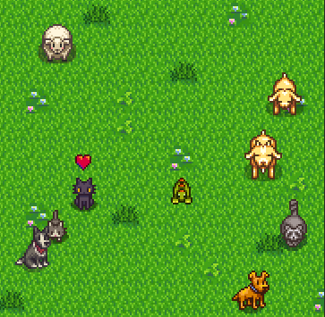

# Stardew Pets

Keep your favourite stardew pets with you while coding.

## How to use

Stardew Pets can be found at the explorer panel. In case it does not appear, try right clicking in the background and seeing if it is disabled.

## Pets

Stardew Pets currently has: cats, dogs, dinos, turtles, raccoons, goats, sheeps, ostrichs, pigs, rabbits, chicken, cows and junimos!

